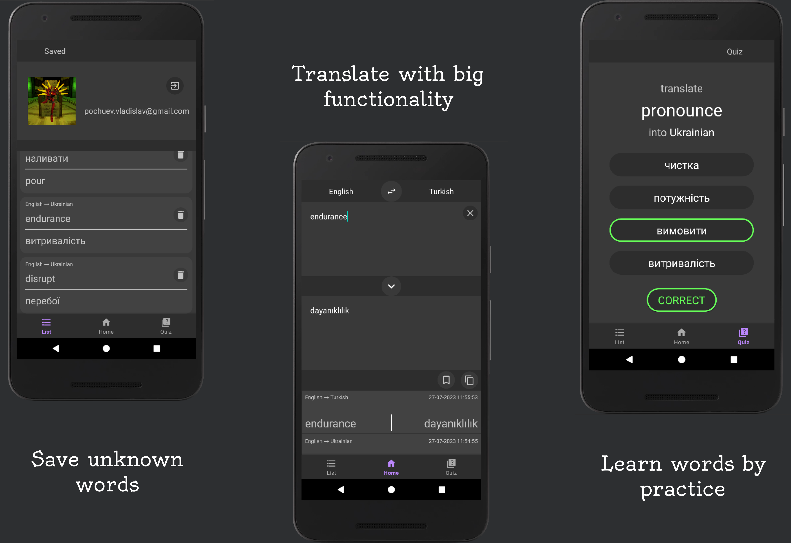

# Translate App
Unofficial android app that can help translate words in more than hundred languages.
Also it can help with managing and learning target words.



## Specific libraries
- App uses [Lingvanex API](https://lingvanex.com/) to get translation of target words and phrases.
- Users data (like translations and images) saves and contains in Firebase Realtime Database and Firebase Storage.
- App conecting with cloud storage using [Picasso](https://square.github.io/picasso/).

## Installation
To install project on your machine just use following comand 
```command
git clone https://github.com/vladpochuev/translateApp
```
